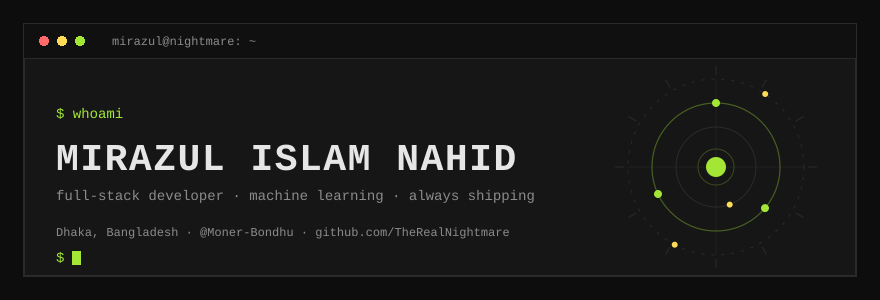
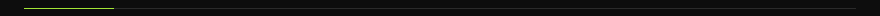
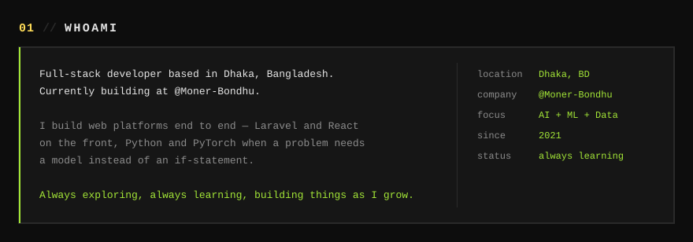
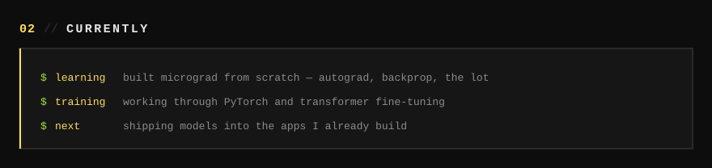
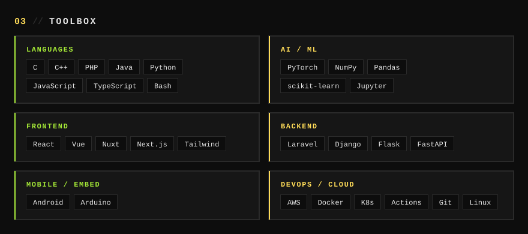
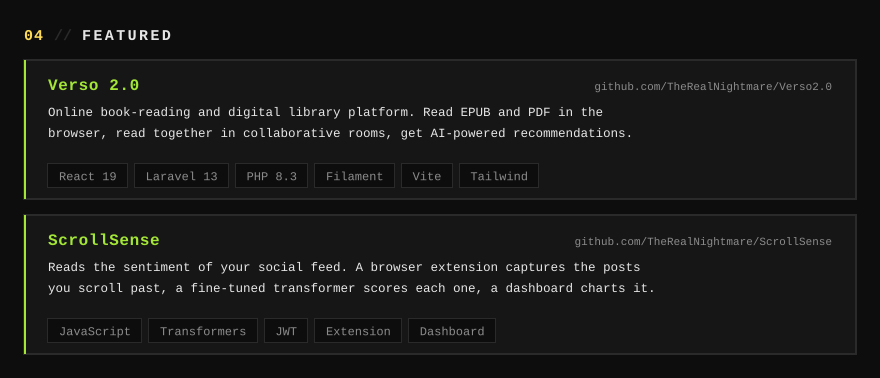
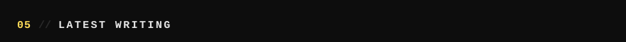
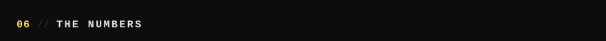
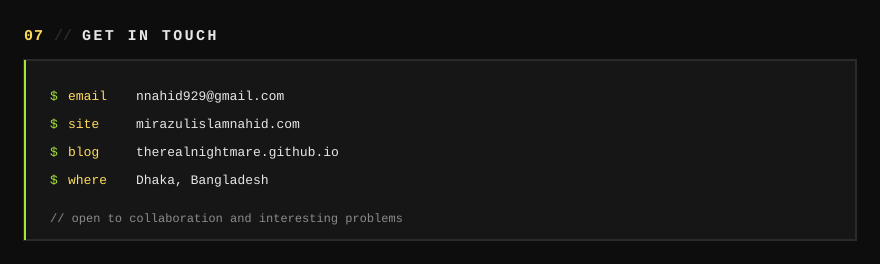

  

  
  
  
  
  
  
  

  

  

  

  
   
  
   
  
   
  

  

  
  
  

  

<!-- BLOG-POST-LIST:START -->
- [From Localhost to Production: Building a Robust CI/CD Pipeline for Nuxt.js on AWS EC2](https://therealnightmare.github.io/posts/building-cicd-pipeline-nuxt-aws/)
<!-- BLOG-POST-LIST:END -->

  

  

  

  

